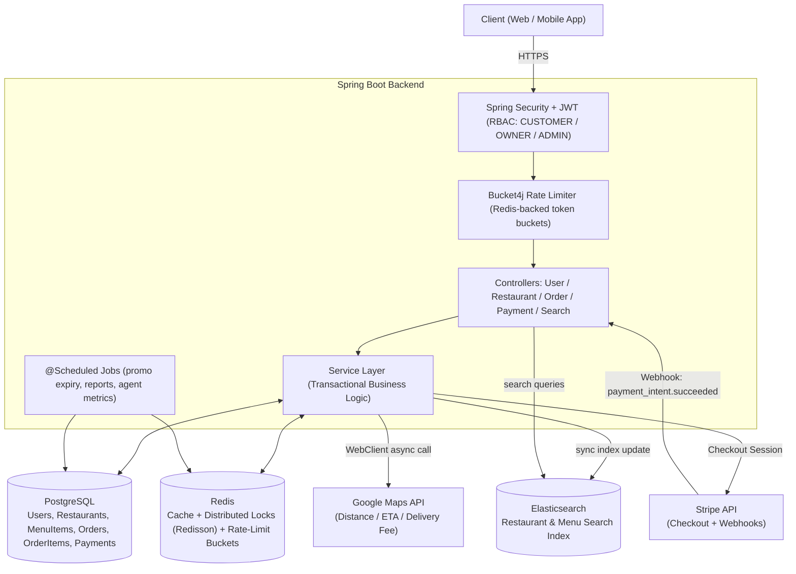

# Zomato Clone — Spring Boot Backend Blueprint

A production-grade blueprint for an intermediate-to-advanced portfolio piece: a food delivery backend capable of handling 5,000+ orders/hour, with caching, distributed locking, payment resiliency, and search.

---

## 1. System Architecture



**Flow notes:**

- Every request passes through a **Bucket4j** filter backed by Redis so rate limits are consistent across horizontally-scaled instances.
- Read-heavy endpoints (restaurant listings, menus) hit **Redis cache-aside** before touching Postgres.
- Order placement acquires a **Redisson distributed lock** on the specific menu-item/inventory key to prevent overselling across concurrent instances.
- Payment confirmation is **event-driven** via Stripe webhooks, decoupling the checkout request from final order confirmation.
- Menu/restaurant writes trigger an **async sync job** to Elasticsearch (write-behind), keeping Postgres as the source of truth.

---

## 2. Database Schema (PostgreSQL DDL)

```sql
-- =========================================================
-- USERS
-- =========================================================
CREATE TABLE users (
    id              BIGSERIAL PRIMARY KEY,
    email           VARCHAR(255) NOT NULL UNIQUE,
    password_hash   VARCHAR(255) NOT NULL,
    full_name       VARCHAR(150) NOT NULL,
    phone_number    VARCHAR(20),
    role            VARCHAR(30)  NOT NULL DEFAULT 'ROLE_CUSTOMER'
                     CHECK (role IN ('ROLE_CUSTOMER','ROLE_RESTAURANT_OWNER','ROLE_ADMIN')),
    is_active       BOOLEAN      NOT NULL DEFAULT TRUE,
    created_at      TIMESTAMPTZ  NOT NULL DEFAULT now(),
    updated_at      TIMESTAMPTZ  NOT NULL DEFAULT now()
);
CREATE INDEX idx_users_email ON users(email);

-- =========================================================
-- RESTAURANTS
-- =========================================================
CREATE TABLE restaurants (
    id              BIGSERIAL PRIMARY KEY,
    owner_id        BIGINT NOT NULL REFERENCES users(id),
    name            VARCHAR(200) NOT NULL,
    description     TEXT,
    cuisine_type    VARCHAR(100),
    latitude        DOUBLE PRECISION NOT NULL,
    longitude       DOUBLE PRECISION NOT NULL,
    address         TEXT NOT NULL,
    is_active       BOOLEAN NOT NULL DEFAULT TRUE,
    avg_rating      NUMERIC(2,1) DEFAULT 0.0,
    created_at      TIMESTAMPTZ NOT NULL DEFAULT now(),
    updated_at      TIMESTAMPTZ NOT NULL DEFAULT now()
);
CREATE INDEX idx_restaurants_owner ON restaurants(owner_id);
CREATE INDEX idx_restaurants_geo ON restaurants(latitude, longitude);

-- =========================================================
-- MENU ITEMS
-- =========================================================
CREATE TABLE menu_items (
    id              BIGSERIAL PRIMARY KEY,
    restaurant_id   BIGINT NOT NULL REFERENCES restaurants(id) ON DELETE CASCADE,
    name            VARCHAR(150) NOT NULL,
    description     TEXT,
    price           NUMERIC(10,2) NOT NULL CHECK (price >= 0),
    is_available    BOOLEAN NOT NULL DEFAULT TRUE,
    -- nullable: only promotional / limited-stock items enforce inventory checks
    stock_quantity  INTEGER,
    is_promotional  BOOLEAN NOT NULL DEFAULT FALSE,
    version         BIGINT NOT NULL DEFAULT 0,  -- optimistic locking backstop
    created_at      TIMESTAMPTZ NOT NULL DEFAULT now(),
    updated_at      TIMESTAMPTZ NOT NULL DEFAULT now()
);
CREATE INDEX idx_menu_items_restaurant ON menu_items(restaurant_id);

-- =========================================================
-- ORDERS
-- =========================================================
CREATE TABLE orders (
    id                  BIGSERIAL PRIMARY KEY,
    customer_id         BIGINT NOT NULL REFERENCES users(id),
    restaurant_id       BIGINT NOT NULL REFERENCES restaurants(id),
    status              VARCHAR(30) NOT NULL DEFAULT 'CART'
                         CHECK (status IN ('CART','CHECKOUT_PENDING','PAYMENT_PENDING',
                                           'CONFIRMED','PREPARING','OUT_FOR_DELIVERY',
                                           'DELIVERED','CANCELLED','PAYMENT_FAILED')),
    subtotal_amount     NUMERIC(10,2) NOT NULL DEFAULT 0,
    delivery_fee        NUMERIC(10,2) NOT NULL DEFAULT 0,
    total_amount        NUMERIC(10,2) NOT NULL DEFAULT 0,
    delivery_latitude   DOUBLE PRECISION,
    delivery_longitude  DOUBLE PRECISION,
    idempotency_key     VARCHAR(100) UNIQUE, -- guards against duplicate order creation
    created_at          TIMESTAMPTZ NOT NULL DEFAULT now(),
    updated_at          TIMESTAMPTZ NOT NULL DEFAULT now()
);
CREATE INDEX idx_orders_customer ON orders(customer_id);
CREATE INDEX idx_orders_restaurant_status ON orders(restaurant_id, status);

-- =========================================================
-- ORDER ITEMS
-- =========================================================
CREATE TABLE order_items (
    id              BIGSERIAL PRIMARY KEY,
    order_id        BIGINT NOT NULL REFERENCES orders(id) ON DELETE CASCADE,
    menu_item_id    BIGINT NOT NULL REFERENCES menu_items(id),
    quantity        INTEGER NOT NULL CHECK (quantity > 0),
    unit_price      NUMERIC(10,2) NOT NULL, -- snapshot at time of order
    line_total      NUMERIC(10,2) NOT NULL
);
CREATE INDEX idx_order_items_order ON order_items(order_id);

-- =========================================================
-- PAYMENTS
-- =========================================================
CREATE TABLE payments (
    id                      BIGSERIAL PRIMARY KEY,
    order_id                BIGINT NOT NULL REFERENCES orders(id),
    stripe_payment_intent_id VARCHAR(255) UNIQUE,
    stripe_event_id         VARCHAR(255) UNIQUE, -- last processed webhook event, for idempotency
    amount                  NUMERIC(10,2) NOT NULL,
    currency                VARCHAR(10) NOT NULL DEFAULT 'inr',
    status                  VARCHAR(30) NOT NULL DEFAULT 'PENDING'
                             CHECK (status IN ('PENDING','SUCCEEDED','FAILED','REFUNDED')),
    created_at              TIMESTAMPTZ NOT NULL DEFAULT now(),
    updated_at              TIMESTAMPTZ NOT NULL DEFAULT now()
);
CREATE INDEX idx_payments_order ON payments(order_id);
```

**Design notes:**

- `orders.idempotency_key` and `payments.stripe_event_id` are both `UNIQUE` — this is what makes double-submit and duplicate-webhook protection a database-level guarantee, not just an application-level convention.
- `menu_items.stock_quantity` is nullable so only promotional/limited items pay the cost of inventory tracking; regular items skip it entirely.
- `menu_items.version` is a backstop optimistic-lock column in case a request ever bypasses the distributed lock path (e.g., an internal batch job).

---

## 3. Core Code Implementation

### 3.1 Redis Cache Configuration

```java
@Configuration
@EnableCaching
public class RedisCacheConfig {

    // Centralized TTL policy per cache region — avoids scattering magic numbers
    // across services and makes cache tuning a one-file change.
    @Bean
    public RedisCacheManager cacheManager(RedisConnectionFactory connectionFactory) {
        RedisCacheConfiguration defaultConfig = RedisCacheConfiguration.defaultCacheConfig()
                .entryTtl(Duration.ofMinutes(10))
                .disableCachingNullValues()
                .serializeValuesWith(RedisSerializationContext.SerializationPair
                        .fromSerializer(new GenericJackson2JsonRedisSerializer()));

        Map<String, RedisCacheConfiguration> cacheConfigs = new HashMap<>();
        // Restaurant listings churn less often -> longer TTL
        cacheConfigs.put("restaurantListings", defaultConfig.entryTtl(Duration.ofMinutes(15)));
        // Menus change whenever an owner edits them -> shorter TTL + explicit eviction (see below)
        cacheConfigs.put("restaurantMenus", defaultConfig.entryTtl(Duration.ofMinutes(5)));

        return RedisCacheManager.builder(connectionFactory)
                .cacheDefaults(defaultConfig)
                .withInitialCacheConfigurations(cacheConfigs)
                .build();
    }
}
```

```java
@Service
@RequiredArgsConstructor
public class RestaurantMenuService {

    private final MenuItemRepository menuItemRepository;

    // Cache-aside read: served from Redis on subsequent calls until TTL expiry or eviction
    @Cacheable(value = "restaurantMenus", key = "#restaurantId")
    public List<MenuItemDto> getMenu(Long restaurantId) {
        return menuItemRepository.findByRestaurantIdAndIsAvailableTrue(restaurantId)
                .stream().map(MenuItemDto::fromEntity).toList();
    }

    // Explicit eviction the moment an owner updates their menu — correctness over
    // waiting out the TTL, since stale menus/prices directly affect checkout totals.
    @CacheEvict(value = "restaurantMenus", key = "#restaurantId")
    @Transactional
    public MenuItemDto updateMenuItem(Long restaurantId, Long itemId, MenuItemUpdateRequest req) {
        MenuItem item = menuItemRepository.findByIdAndRestaurantId(itemId, restaurantId)
                .orElseThrow(() -> new ResourceNotFoundException("Menu item not found"));
        item.setPrice(req.price());
        item.setAvailable(req.available());
        return MenuItemDto.fromEntity(item);
    }
}
```

### 3.2 Singleton Global Configuration Holder

```java
// Spring beans are singletons by default, so this demonstrates the pattern
// explicitly for a case where lazy, thread-safe initialization matters —
// e.g. loading immutable platform-wide settings once at startup.
@Component
public class SystemConfigRegistry {

    private static volatile SystemConfigRegistry instance;
    private final Map<String, String> settings = new ConcurrentHashMap<>();

    private SystemConfigRegistry() {
        settings.put("MAX_CART_ITEMS", "50");
        settings.put("DEFAULT_DELIVERY_RADIUS_KM", "12");
    }

    public static SystemConfigRegistry getInstance() {
        if (instance == null) {
            synchronized (SystemConfigRegistry.class) { // double-checked locking
                if (instance == null) {
                    instance = new SystemConfigRegistry();
                }
            }
        }
        return instance;
    }

    public String get(String key) {
        return settings.get(key);
    }
}
```

### 3.3 Order Placement with a Redis Distributed Lock (Redisson)

```java
@Service
@RequiredArgsConstructor
@Slf4j
public class OrderPlacementService {

    private final RedissonClient redissonClient;
    private final MenuItemRepository menuItemRepository;
    private final OrderRepository orderRepository;

    private static final long LOCK_WAIT_SECONDS = 3;
    private static final long LOCK_LEASE_SECONDS = 10;

    @Transactional
    public Order placeOrder(Long customerId, PlaceOrderRequest request) {
        // Lock is scoped per menu item so unrelated items don't contend with each other.
        // Only promotional/limited-stock items need this; regular items skip locking entirely.
        List<RLock> acquiredLocks = new ArrayList<>();
        try {
            for (OrderItemRequest itemReq : request.items()) {
                MenuItem menuItem = menuItemRepository.findById(itemReq.menuItemId())
                        .orElseThrow(() -> new ResourceNotFoundException("Menu item not found"));

                if (menuItem.isPromotional()) {
                    RLock lock = redissonClient.getLock("lock:menu_item:" + menuItem.getId());
                    boolean acquired = lock.tryLock(LOCK_WAIT_SECONDS, LOCK_LEASE_SECONDS, TimeUnit.SECONDS);
                    if (!acquired) {
                        throw new ConcurrentModificationException(
                                "High demand on item " + menuItem.getId() + " — please retry");
                    }
                    acquiredLocks.add(lock);

                    // Re-fetch inside the lock to get the latest committed stock value
                    MenuItem freshItem = menuItemRepository.findById(menuItem.getId()).orElseThrow();
                    if (freshItem.getStockQuantity() < itemReq.quantity()) {
                        throw new InsufficientStockException(
                                "Item " + freshItem.getName() + " is out of stock");
                    }
                    freshItem.setStockQuantity(freshItem.getStockQuantity() - itemReq.quantity());
                    menuItemRepository.save(freshItem);
                }
            }

            Order order = buildOrderFromRequest(customerId, request);
            Order saved = orderRepository.save(order);
            log.info("order_created orderId={} customerId={} total={}",
                    saved.getId(), customerId, saved.getTotalAmount());
            return saved;

        } catch (InterruptedException e) {
            Thread.currentThread().interrupt();
            throw new RuntimeException("Lock acquisition interrupted", e);
        } finally {
            // Always release in reverse-acquisition order; only unlock if this thread holds it
            for (RLock lock : acquiredLocks) {
                if (lock.isHeldByCurrentThread()) {
                    lock.unlock();
                }
            }
        }
    }

    private Order buildOrderFromRequest(Long customerId, PlaceOrderRequest request) {
        // ... maps DTO to Order + OrderItem entities, computes subtotal/delivery fee/total
        throw new UnsupportedOperationException("mapping logic omitted for brevity");
    }
}
```

### 3.4 Stripe Webhook Handling with Idempotency

```java
@RestController
@RequestMapping("/api/webhooks/stripe")
@RequiredArgsConstructor
@Slf4j
public class StripeWebhookController {

    private final PaymentService paymentService;

    @Value("${stripe.webhook.secret}")
    private String webhookSecret;

    @PostMapping
    public ResponseEntity<String> handleWebhook(
            @RequestBody String payload,
            @RequestHeader("Stripe-Signature") String sigHeader) {

        Event event;
        try {
            // Verifying the signature is what proves this request actually came from
            // Stripe and wasn't forged by a third party hitting this public endpoint.
            event = Webhook.constructEvent(payload, sigHeader, webhookSecret);
        } catch (SignatureVerificationException e) {
            log.warn("stripe_webhook_invalid_signature");
            return ResponseEntity.status(HttpStatus.BAD_REQUEST).body("Invalid signature");
        }

        switch (event.getType()) {
            case "payment_intent.succeeded" -> paymentService.handlePaymentSucceeded(event);
            case "payment_intent.payment_failed" -> paymentService.handlePaymentFailed(event);
            default -> log.info("stripe_webhook_ignored type={}", event.getType());
        }

        return ResponseEntity.ok("received");
    }
}
```

```java
@Service
@RequiredArgsConstructor
@Slf4j
public class PaymentService {

    private final PaymentRepository paymentRepository;
    private final OrderRepository orderRepository;

    @Transactional
    public void handlePaymentSucceeded(Event event) {
        // Stripe can and will retry webhook delivery. The unique constraint on
        // stripe_event_id is the real safety net; this check just short-circuits
        // the common case without hitting a constraint-violation exception path.
        if (paymentRepository.existsByStripeEventId(event.getId())) {
            log.info("stripe_webhook_duplicate_skipped eventId={}", event.getId());
            return;
        }

        PaymentIntent intent = (PaymentIntent) event.getDataObjectDeserializer()
                .getObject().orElseThrow();

        Payment payment = paymentRepository.findByStripePaymentIntentId(intent.getId())
                .orElseThrow(() -> new ResourceNotFoundException("Payment record not found"));

        payment.setStatus("SUCCEEDED");
        payment.setStripeEventId(event.getId());
        paymentRepository.save(payment);

        Order order = orderRepository.findById(payment.getOrderId()).orElseThrow();
        order.setStatus("CONFIRMED");
        orderRepository.save(order);

        log.info("payment_confirmed orderId={} paymentIntentId={} amount={}",
                order.getId(), intent.getId(), payment.getAmount());
    }

    @Transactional
    public void handlePaymentFailed(Event event) {
        // ... mirrors handlePaymentSucceeded: mark payment FAILED, order PAYMENT_FAILED
    }
}
```

### 3.5 Elasticsearch — Fuzzy Search over Restaurants & Menus

```java
@Document(indexName = "restaurants")
@Data
public class RestaurantDocument {

    @Id
    private String id;

    @Field(type = FieldType.Text, analyzer = "standard")
    private String name;

    @Field(type = FieldType.Text)
    private String cuisineType;

    @Field(type = FieldType.Nested)
    private List<String> menuItemNames; // denormalized for single-query search across menu + restaurant

    @Field(type = FieldType.Double)
    private Double avgRating;

    @GeoPointField
    private GeoPoint location;
}
```

```java
public interface RestaurantSearchRepository
        extends ElasticsearchRepository<RestaurantDocument, String> {

    // Spring Data derives a fuzzy match query from the method name;
    // Fuzziness.AUTO tolerates minor typos ("pzza" -> "pizza").
    List<RestaurantDocument> findByNameContainingOrMenuItemNamesContaining(
            String name, String menuItemName);
}
```

```java
@Service
@RequiredArgsConstructor
public class RestaurantSearchService {

    private final ElasticsearchOperations elasticsearchOperations;

    public List<RestaurantDocument> fuzzySearch(String query, double lat, double lon, double radiusKm) {
        Query searchQuery = NativeQuery.builder()
                .withQuery(q -> q
                        .bool(b -> b
                                .must(m -> m.multiMatch(mm -> mm
                                        .fields("name", "cuisineType", "menuItemNames")
                                        .query(query)
                                        .fuzziness("AUTO"))) // absorbs typos & partial matches
                                .filter(f -> f.geoDistance(gd -> gd
                                        .field("location")
                                        .distance(radiusKm + "km")
                                        .location(loc -> loc.latlon(l -> l.lat(lat).lon(lon)))))
                        ))
                .build();

        SearchHits<RestaurantDocument> hits = elasticsearchOperations.search(searchQuery, RestaurantDocument.class);
        return hits.stream().map(SearchHit::getContent).toList();
    }
}
```

### 3.6 Structured Logging Across the Order Transaction Lifecycle

```java
@Service
@RequiredArgsConstructor
@Slf4j
public class OrderLifecycleService {

    private final OrderRepository orderRepository;

    @Transactional
    public void transitionStatus(Long orderId, String newStatus) {
        Order order = orderRepository.findById(orderId)
                .orElseThrow(() -> new ResourceNotFoundException("Order not found: " + orderId));

        String previousStatus = order.getStatus();

        // MDC puts orderId on every subsequent log line for this thread, so a single
        // grep on orderId reconstructs the full audit trail across services/classes.
        MDC.put("orderId", String.valueOf(orderId));
        try {
            order.setStatus(newStatus);
            orderRepository.save(order);

            log.info("order_status_transition from={} to={} timestamp={}",
                    previousStatus, newStatus, Instant.now());

        } catch (Exception ex) {
            log.error("order_status_transition_failed from={} attemptedTo={} error={}",
                    previousStatus, newStatus, ex.getMessage(), ex);
            throw ex;
        } finally {
            MDC.remove("orderId");
        }
    }
}
```

```xml
<!-- logback-spring.xml: JSON layout so logs are directly queryable in
     ELK/Datadog/CloudWatch without a separate parsing step -->
<configuration>
    <appender name="JSON_CONSOLE" class="ch.qos.logback.core.ConsoleAppender">
        <encoder class="net.logstash.logback.encoder.LogstashEncoder">
            <includeMdcKeyName>orderId</includeMdcKeyName>
        </encoder>
    </appender>
    <root level="INFO">
        <appender-ref ref="JSON_CONSOLE" />
    </root>
</configuration>
```

---

## 4. Rate Limiting (Bucket4j + Redis) — Quick Reference

```java
@Component
public class RateLimitFilter extends OncePerRequestFilter {

    private final ProxyManager<String> bucketProxyManager; // backed by Redis, shared across instances

    public RateLimitFilter(RedisClient redisClient) {
        this.bucketProxyManager = LettuceBasedProxyManager.builderFor(redisClient).build();
    }

    @Override
    protected void doFilterInternal(HttpServletRequest req, HttpServletResponse res, FilterChain chain)
            throws ServletException, IOException {

        String userKey = resolveUserKey(req); // e.g. authenticated user ID or client IP
        BucketConfiguration config = BucketConfiguration.builder()
                .addLimit(Bandwidth.classic(100, Refill.greedy(100, Duration.ofMinutes(1))))
                .build();

        Bucket bucket = bucketProxyManager.builder().build(userKey, () -> config);

        if (bucket.tryConsume(1)) {
            chain.doFilter(req, res);
        } else {
            res.setStatus(429);
            res.getWriter().write("Rate limit exceeded — try again shortly");
        }
    }

    private String resolveUserKey(HttpServletRequest req) {
        String auth = req.getHeader("Authorization");
        return auth != null ? auth : req.getRemoteAddr();
    }
}
```

---

## 5. What to Build Next (Suggested Order)

1. Postgres schema + JPA entities + repositories — get CRUD working end-to-end first.
2. RBAC with Spring Security + JWT.
3. Redis caching on read paths (`restaurantListings`, `restaurantMenus`).
4. Order placement + distributed lock for promotional items.
5. Stripe checkout + webhook + idempotency.
6. Elasticsearch sync (write-behind on menu/restaurant updates) + fuzzy search endpoint.
7. Bucket4j rate limiting filter.
8. `@Scheduled` jobs: promo expiry, daily report generation, delivery agent metrics.
9. Structured logging + MDC correlation IDs across the whole request lifecycle.

This ordering lets you demo a working (if unoptimized) system after step 4, then layer in the "extra mile" resiliency and scale features incrementally — which also makes for a much stronger portfolio narrative than a big-bang build.